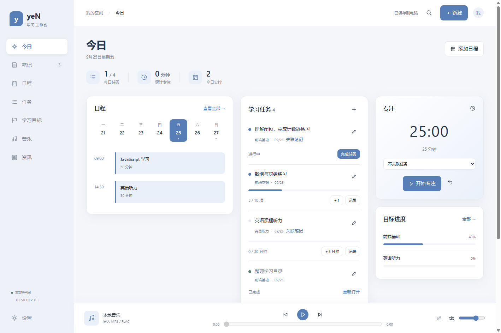
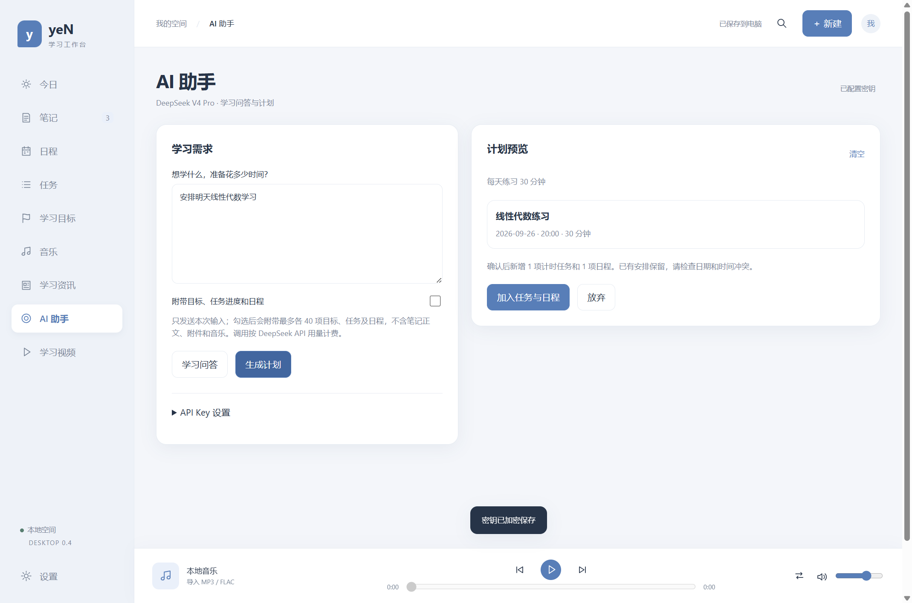

# yeN

yeN 是一个面向 Windows 的个人学习工作台。它把笔记、任务、学习目标、日程、音乐、学习资讯、视频和 AI 学习助手放在一个简洁的桌面应用中。

项目仍在持续开发。个人笔记、附件、媒体与 API Key 均保存在本机，不随源码上传到 GitHub。



## 当前功能

- 笔记：富文本、图片、自由绘画、附件、文件夹和搜索。
- 计划：日、周、月、年日历，任务进度、重复日程、学习目标和专注计时。
- AI 助手：接入 DeepSeek V4 Pro，支持连续对话、学习技能和计划提案；计划经过预览确认才会加入任务与日程。
- 本地媒体：MP3 / FLAC 音乐播放器和自定义歌单，以及 MP4 / WebM 视频播放、调速和 SRT / VTT 字幕。
- 学习资讯：AI、数学、金融 RSS 分类，可收藏到笔记。
- 课程发现：从 yeN 发起 B 站学习内容搜索。
- 后台运行：关闭窗口后进入 Windows 系统托盘，继续播放音乐和提供日程提醒。
- 外观：支持浅色、深色和跟随 Windows 系统，可继续搭配多套主色。
- 窗口：统一配色的标题栏，保留原生窗口按钮、拖动和贴边吸附；侧栏独立滚动，小窗口也能打开设置。
- 笔记：支持一键进入沉浸式全屏编辑，Esc 退出。
- 本地数据：原子保存、上一版本恢复、自动快照和完整导入导出。

## 后台运行

默认启用。点击窗口关闭按钮后，yeN 会先保存数据，再隐藏到 Windows 右下角托盘：

- 单击托盘图标：重新打开 yeN。
- 右键托盘图标：打开 yeN 或彻底退出。
- 设置 → 后台运行：可关闭该功能；关闭后，关闭主窗口即退出程序。

## AI 与隐私



AI 助手默认使用 `deepseek-v4-pro`。API Key 通过 Electron `safeStorage` 使用 Windows 系统能力加密，独立保存在用户数据目录，不进入笔记数据或 JSON 备份。

默认只发送本次输入和当前日期。用户主动勾选后，才会附带有限数量的目标、任务进度和日程；笔记正文、附件、音乐和视频不会发送。AI 调用由用户手动触发，并按 DeepSeek API 用量计费。

## 技术栈

- Electron 44
- 原生 HTML、CSS、JavaScript
- Node.js 本地存储与 IPC
- Playwright 和 Node.js Test Runner
- electron-builder

## 开发

需要 Windows x64 和 Node.js 22.12 或更高版本：

```powershell
npm ci
npm start
```

常用验证：

```powershell
node --test tests/storage.test.cjs tests/export.test.cjs tests/ai.test.cjs
node tests/tray.test.cjs
node tests/learning.test.cjs
```

AI 测试使用本地模拟响应，不需要真实 API Key，也不会产生费用。

Windows 打包：

```powershell
powershell -ExecutionPolicy Bypass -File scripts/package-windows.ps1
```

输出位于 `release/`。当前个人开发版本没有商业代码签名证书。

新安装时，安装器优先选择 `E:\Apps\yeN`，没有 E 盘时选择 `D:\Apps\yeN`；两者都不存在时使用 Windows 默认目录。升级会沿用现有安装位置，安装页面也允许手动修改目录。

## 目录

```text
desktop/    Electron 主进程、存储、媒体、资讯和 AI 接口
src/        界面、样式和交互
scripts/    前端构建与 Windows 打包脚本
tests/      数据安全、桌面交互、媒体、AI 和托盘测试
build/      应用图标
```

待开发想法记录在 [IDEAS.md](IDEAS.md)。

## 数据安全

软件数据与源码分开存放。`node_modules`、构建结果、测试输出、个人数据目录、环境变量、私钥和 DeepSeek 密钥均已加入 `.gitignore`。

状态文件通过临时文件写入并原子替换，同时保留上一份状态。自动快照保留最近 7 份；跨电脑迁移请使用应用内的“导出完整备份”。

## 自动更新

安装版启动后及每 6 小时从 GitHub Releases 检查新版，后台下载并校验 SHA-512。设置 → 软件更新可以手动检查，下载后点击“重启更新”。重启前会保存编辑内容并强制建立本地快照；保存或备份失败时停止更新。普通退出不会自动安装。安装位置与独立的数据目录保持不变，下载缓存位于用户数据目录下的 UpdateCache。更新检查不上传笔记、媒体、聊天、设置或密钥。

0.7.0 及更早版本需要用安装包覆盖升级一次；0.8.0 起支持上述更新流程。便携版仍需手动替换程序。

发布时仅上传安装包、便携包、latest.yml 和安装包的 .blockmap；所有附件上传完整后再公开 Release。
